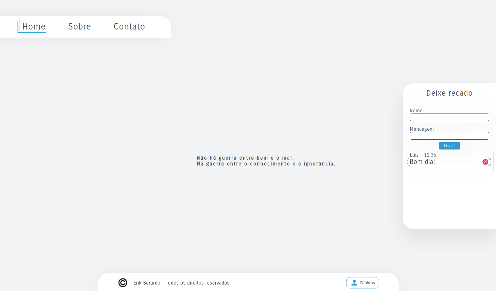
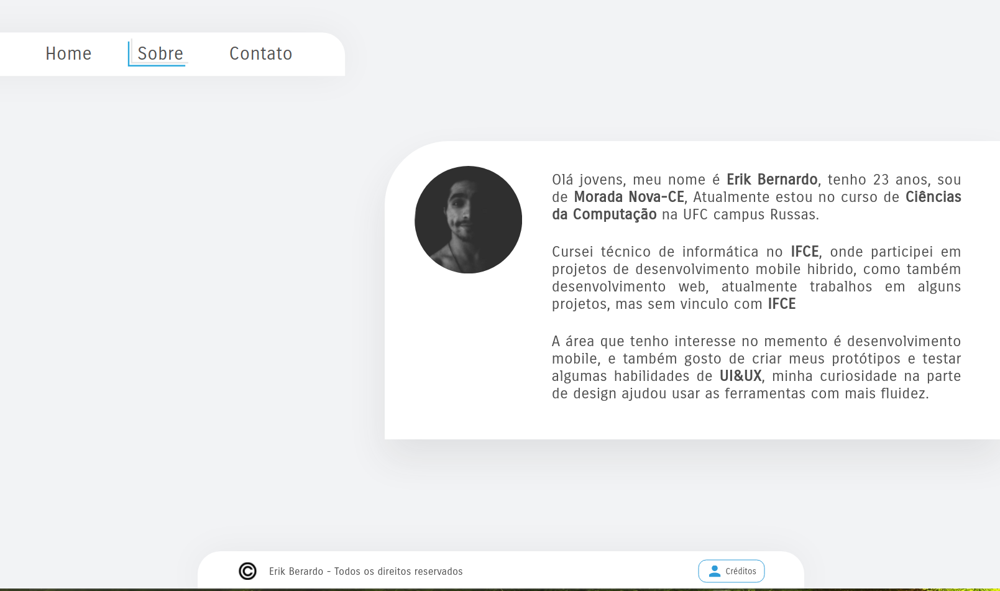
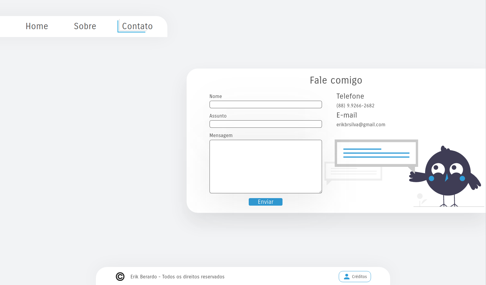
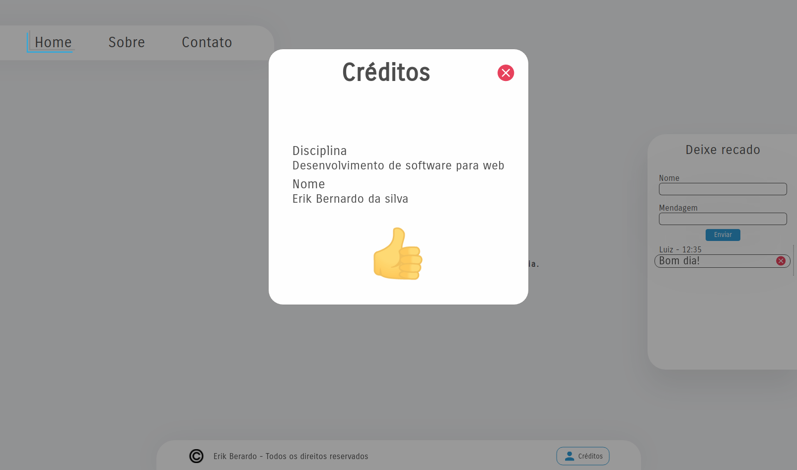

<h1 align="center">
    <strong>Movie Wall</strong>
</h1>

  <a href="#-tecnologias">Tecnologias</a>&nbsp;&nbsp;&nbsp;|&nbsp;&nbsp;&nbsp;
  <a href="#-projeto">Projeto</a>&nbsp;&nbsp;&nbsp;|&nbsp;&nbsp;&nbsp;
  <a href="#-layout">Layout</a>&nbsp;&nbsp;&nbsp;|&nbsp;&nbsp;&nbsp;
  <a href="#-como-executar">Como executar</a>&nbsp;&nbsp;&nbsp;|&nbsp;&nbsp;&nbsp;

 

    <apan align="center">
      
    </apan>
    
      
    

    <apan align="center">
      
    </apan>
    
      
    

## ✨ Tecnologias

Esse projeto foi desenvolvido com as seguintes tecnologias:

- HTML
- Css
- JavaScript

## 💻 Projeto

Esse projeto e uma avaliação para disciplina de desenvolvimento de software para web, onde tinha os seguintes requisitos.

Crie um menu com três links para, respectivamente, apontarem para três
páginas

- Home – Página principal
- Sobre – Página que fala sobre o(s) autor(es)
- Resumo com foto do(s) autor(es)
- Contato – Dados para contato

#### Formulário para contato:

- Campos: Nome, Assunto, Mensagem
- Botão: Enviar

#### Links:

- Telefone que abra aplicação para discagem
- Email que abre aplicação para email

#### detalhes na página Home deve ser criada uma seção que terá a opção de mural de mensagens, então deve ter campos para nome e mensagem e um botão, daí o usuário digita seu nome e a mensagem e clica no botão de submissão,seguidamente aparecerá o nome e mensagem que o usuário enviou

## 🔖 Layout

Você pode visualizar o layout do projeto através do link abaixo. É necessário teruma conta no [Figma](http://figma.com/) para acessá-lo.

[Link para o Layout no figma ](https://www.figma.com/file/mLDiwFk6hONhsCM4P0bxn8/Avali%C3%A7%C3%A3o-I?node-id=0%3A1)

## 🚀 Como executar

- Clone o repositório
- Abra no brownser
